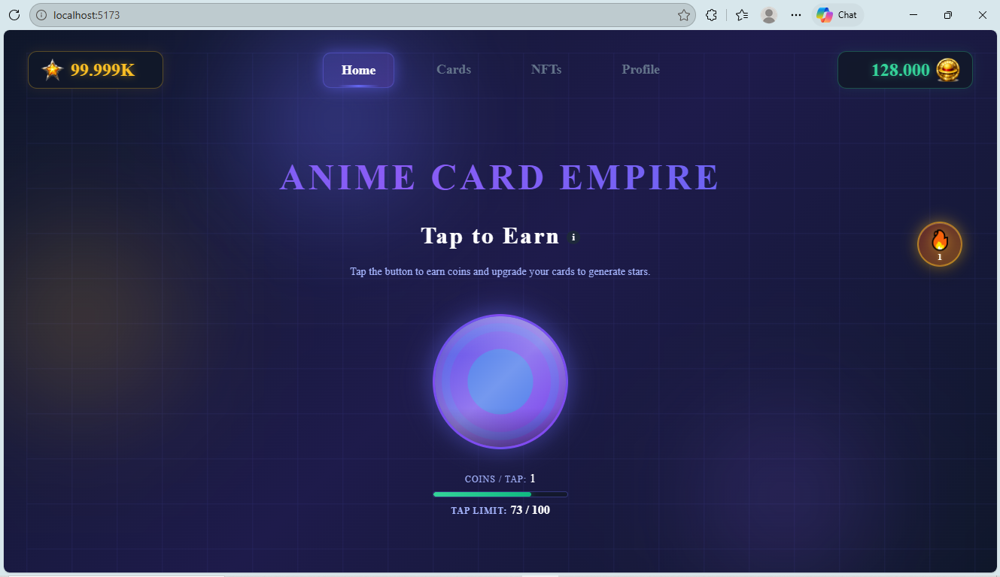
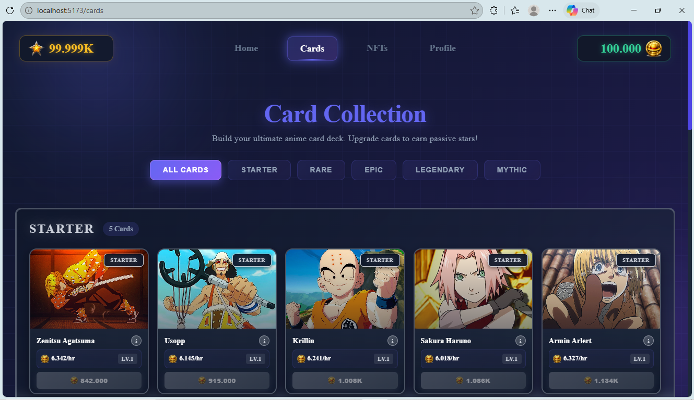
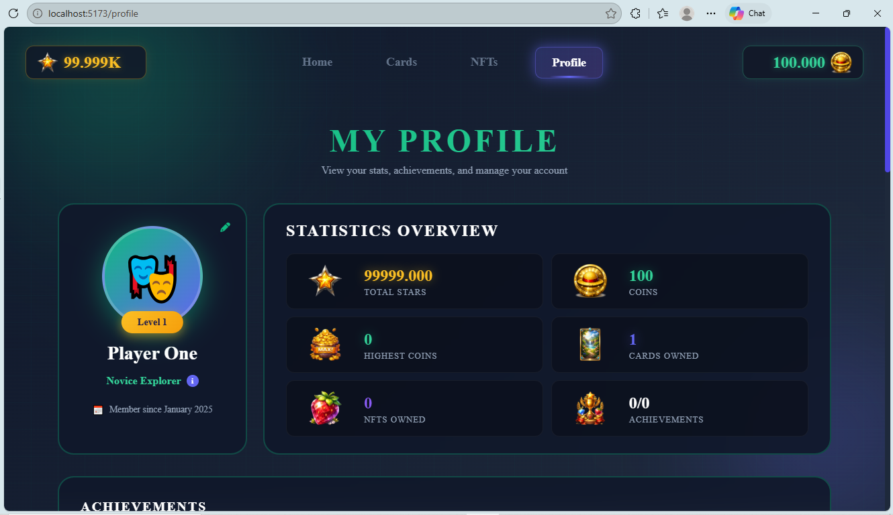
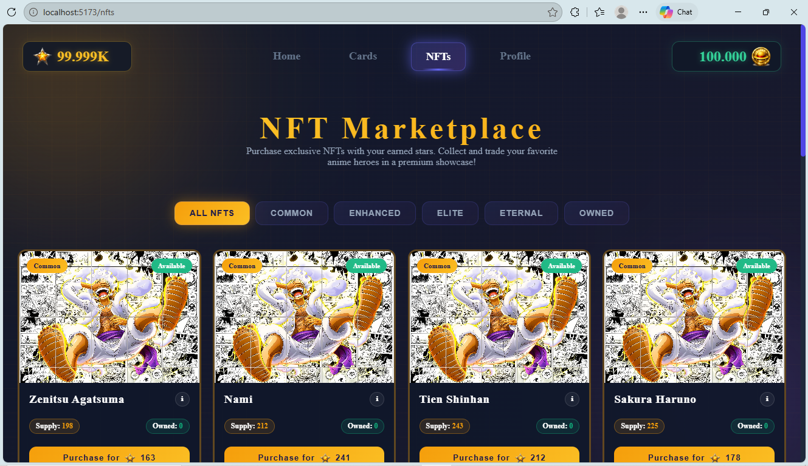

# Anime Card Empire 🃏✨

[](https://react.dev)
[](https://vitejs.dev)
[](https://tailwindcss.com)
[](https://firebase.google.com)
[](https://eslint.org)

## 🚀 Overview

**Anime Card Empire** - Collect legendary anime cards, tap to earn coins, build your profile stats, and trade NFTs in your ultimate anime empire! A fun tap-to-earn game featuring iconic characters from Naruto, Dragon Ball, Demon Slayer, Jujutsu Kaisen, and more.

<div align="center">
  <!-- Demo link placeholder - add your deployed URL here -->
  <a href="https://anime-card-empire.vercel.app/" target="_blank">
    
  </a>
</div>

## 📱 Screenshots

| Home (Tap Game) | Cards Collection | Profile | NFT Marketplace |
| --- | --- | --- | --- |
|  |  |  |  |


## ✨ Features

- 🎮 **Tap-to-Earn Mechanics**: Tap for coins with cooldowns, streaks, and multipliers
- 🃏 **Anime Card Collection**: 20+ legendary cards (Goku, Naruto, Gojo, Saitama, etc.) with star ratings
- 📊 **Player Profile**: Stats, achievements (VIP, Veteran, Richest), settings (sound, notifications)
- 🛒 **NFT Marketplace**: Buy/sell/trade anime NFTs
- 🔥 **Game Context & Hooks**: Global state management with React Context
- 📱 **Responsive UI**: TailwindCSS styled, mobile-first design
- 🛡️ **Firebase Backend**: Auth, Firestore for cards/profiles/NFTs/events/taps
- ⚡ **Fast Dev Experience**: Vite HMR, ESLint, optimized utils (math, cooldown, security)
- 🎨 **Overlays & Modals**: Streak bonuses, Help/Support, Terms/Privacy policies

## 🛠 Tech Stack

| Frontend | Build | Styles | Backend | Utils |
|---------|-------|--------|---------|-------|
| React 18+ | Vite 5+ | TailwindCSS + PostCSS | Firebase/Firestore | Custom hooks/services |

## 🚀 Quick Start

### Prerequisites
- Node.js 18+
- Firebase project (update `src/firebase/firebaseConfig.js`)

### Setup
```bash
# Clone & Install
git clone https://github.com/sundarAlok/anime-card-empire.git
cd anime-card-empire
npm install

# Setup Firebase
# 1. Create project at https://console.firebase.google.com
# 2. Enable Auth & Firestore
# 3. Copy config to src/firebase/firebaseConfig.js
# 4. Update firestore.rules if needed
```

### Development
```bash
npm run dev  # http://localhost:5173
npm run build  # Production build
npm run lint  # Lint code
```

### Deployment (Firebase Hosting)
```bash
npm install -g firebase-tools
firebase login
firebase init hosting  # Select build folder: dist
npm run build
firebase deploy
```

## 📁 Project Structure
```
anime-card-empire/
├── public/                 # Static assets (vite.svg, screenshots)
├── src/
│   ├── assets/             # Images: cards, nfts, profile icons
│   ├── components/         # Reusable: TapButton, TopBar, Overlays
│   ├── context/            # GameContext, useGame hook
│   ├── pages/              # Home, Cards, Profile, NFTMarketplace
│   ├── services/           # Firebase services (auth, cards, nft, tap)
│   ├── styles/             # CSS modules
│   ├── utils/              # math.js, cooldown.js, security.js
│   └── constants/          # gameConfig.js, starRates.js
├── firebase.json           # Firebase config
├── tailwind.config.js      # Tailwind setup
├── package.json            # Dependencies
└── README.md              # You're reading it!
```

## 🤝 Contributing

1. Fork the repo
2. Create feature branch (`git checkout -b feature/amazing-feature`)
3. Commit changes (`git commit -m 'Add amazing feature'`)
4. Push (`git push origin feature/amazing-feature`)
5. Open Pull Request


## 🙌 Acknowledgments

- [Vite](https://vitejs.dev) - Lightning-fast build tool
- [TailwindCSS](https://tailwindcss.com) - Utility-first CSS
- [Firebase](https://firebase.google.com) - Backend services
- Anime fan community for inspiration! 🔥


## 📄 License

This project is licensed under the MIT License.

---

⭐ Star this repo if you like it! Contributions welcome.

